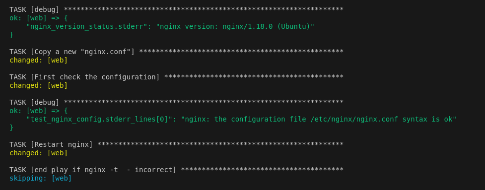

#  Стенд с Vagrant c Rsyslog

Цель домашнего задания
Научится проектировать централизованный сбор логов. 
Рассмотреть особенности разных платформ для сбора логов.

### 1.Настроим стенд Vagrant с двумя виртуальными машинами: web и log.

[Vagrantfile](Vagrantfile)

  

### 2.Пишем playbook

[playbook](playbook.yml)

__Устанавливаем на web и log необходимые пакеты__
  

__Проверим, что nginx работает корректно:__  

__Конфигурируем /etc/nginx/nginx.conf / проверяем конфигурацию / если все ок то прегружаем сервис nginx__

__Конфигурируем /etc/rsyslog.conf__

__Если ошибок не допущено, то у нас будут видны открытые порты TCP,UDP 514:__
  

__Проверяем что логи отправляются корректно__

